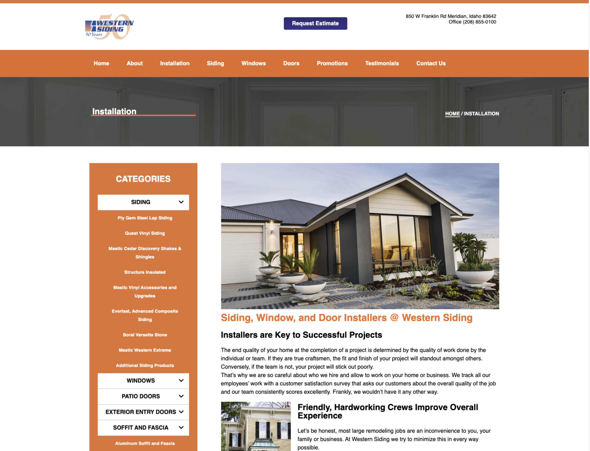

 
 

  

Established in 1970 by Larry Bruck, Western Siding serves Boise, Idaho and the entirety of the Treasure Vally. Over the last four years we’ve grown and prospered by living up to our mission to provide the best quality siding products. By providing these quality products and services, we can make our customers happy they chose Western Siding for their home or business. We do business, as Larry says, “Like ladies and gentlemen.”
Western Siding does not phone solicit or use high pressure sales tactics. We’ll never play games with our pricing of sidings, windows or doors. We hate these sales and marketing tactics and refuse to use them with our customers.

View live: <a href='https://westernsiding.com/'>Western Siding</a>

 

## Features

-   Responsive Design
-   100% Microsoft Stack
     

## Home/Landing Page

-   The landing page has convenient and clearly designed, as well as conveniently placed category links with short animation displaying a brief description.

     

## Category Page

-   Using a \_SubMenu throughout several pages including breadcrumb for easy navigation.

     

## Contact Page

-   Giving a brief description of the company for clarity and transparency
-   Concise contact form for easy use
-   Convenient map, displaying exact store location.

     

# Technologies

-   
-   
-   
-   

     
